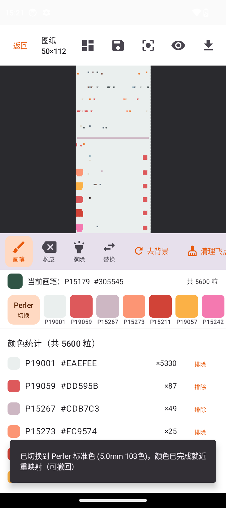
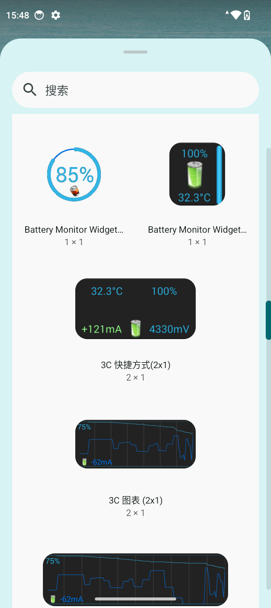
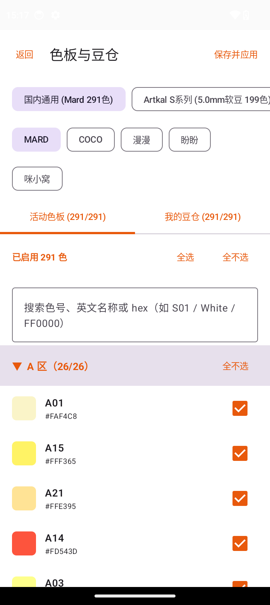
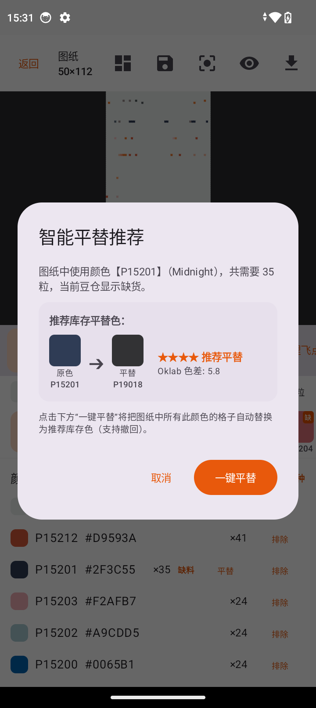
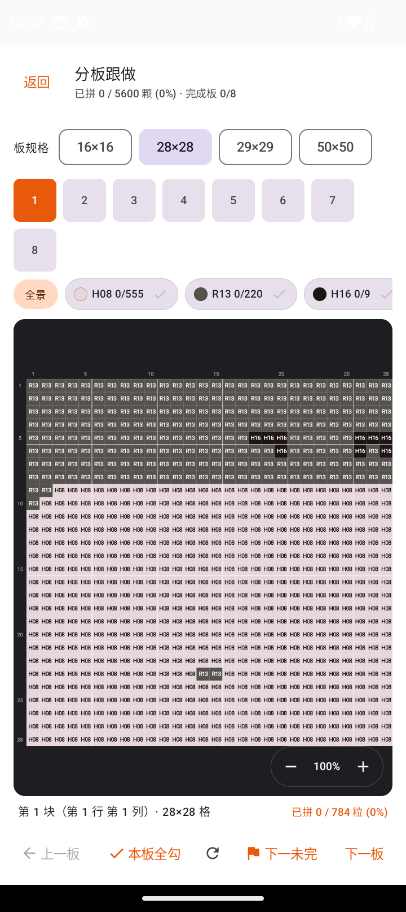

# Beadify - 智能拼豆图纸生成器 (Android)

<div align="center">

<p align="center">
  <strong>基于 Kotlin + Jetpack Compose 打造的工业级、极速原生拼豆与像素艺术设计工坊</strong>
</p>

[-3DDC84.svg?style=flat&logo=android)](https://www.android.com/)
[](https://developer.android.com/)
[](https://kotlinlang.org/)
[](https://developer.android.com/jetpack/compose)
[-brightgreen.svg?style=flat)]()
[]()
[](LICENSE)

[English](./README_EN.md) · [简体中文](./README.md) · [测试规范文档](./docs/TEST_SPECIFICATION.md) · [全量测试报告](./docs/TEST_REPORT.md) · [算法基准评测](./docs/benchmarks/ALGORITHM_BENCHMARK_REPORT.md)

</div>

---

## 📖 关于 Beadify

**Beadify** 是一款专为拼豆（Perler / Fuse / Hama / Artkal Beads）手作玩家、二次元创作者与像素艺术爱好者打造的高性能原生安卓应用。

传统拼豆图纸工具往往受限于 Web 端的内存崩溃、单调的色板匹配、以及排版拉长等问题。Beadify 采用原生 Kotlin 协同硬件加速构建核心算法，在真机上实现了 **1200 万像素大图 0.71 秒瞬时转换**、**7 大国际与国内权威品牌色系互转**、**个人豆仓库存管理与 Oklab 缺色智能平替**，以及支持 **1:1 毫米级物理尺寸打印** 与 **多板切片聚光灯辅助**。

---

## ✨ 核心特性矩阵

### ⚡ 1. 极致性能与智能像素化引擎
* **双模式像素量化**：
  * **卡通模式 (Dominant Color)**：基于局部色彩直方图提取主导色，轮廓清晰锐利，二次元动漫绝佳选择；
  * **写实照片模式 (Average Color)**：RGB 空间加权空间采样，渐变过渡自然平滑；
* **孤岛飞点平滑清洗 (Despeckle / Island Cleanup)**：
  * 采用 8-邻域连通分量分析，智能识别并消除 1~2 粒的离散杂色飞点，大幅提升实体手作可拼性；
* **Floyd-Steinberg 误差扩散抖动**：细腻呈现色彩过渡，消除大面积平涂阶梯感；
* **极速算法与内存保护**：实测 1200 万像素（4000×3000）原图处理仅需 **0.71 秒**，严格执行双重降采样与分块处理，杜绝 OOM。

### 🎨 2. 工业级权威品牌色系体系
* 内置完整 291 色标准色卡数据库；
* 支持 **7 大主流拼豆品牌**即时无损重映射：
  * **Artkal S (软豆)**：国际高精度手作标杆（235 色权威色系）；
  * **Perler**：经典欧美拼豆标准；
  * **国内流行品牌**：MARD / COCO / 漫漫 / 盼盼 / 咪小窝；
* 采用 **CIEDE2000 色差模型**与加权感知色差，色彩还原度达 $\Delta E < 2.5$ 优秀级别。

### 📦 3. 个人豆仓管理与 Oklab 缺色智能平替
* **本地豆仓状态隔离持久化**：
  * 支持快速勾选/取消拥有状态，支持品牌色号模糊检索；
* **缺色视觉警报**：
  * 画布中缺货豆子呈现小红点角标预警，用量统计表红色高亮标记缺货品种；
* **五星推荐智能平替算法**：
  * 基于感知色差模型，在玩家**当前现有库存**中搜索色差最小的替代色；
  * 自动呈现五星直观推荐度（★★★★★ 精准平替），支持一键全图批量替换。

### 🧩 4. 多板切片与“聚光灯”插豆手作辅助
* **大图分板切片 (Board Slicing)**：
  * 支持自动切割为标准方板（如 29×29、50×50 等）；
  * 自动标注子板坐标（例如 Board A1, A2...）；
* **聚光灯模式 (Spotlight Mode)**：
  * 一键高亮当前选中的单个模板板或特定色号，暗化其余区域，对照实体拼豆板插豆护眼不串行。

### 🖨️ 5. 1:1 物理尺寸导出与自适应排版
* **1:1 真实毫米级图纸输出**：
  * 精确支持 2.6mm（小豆）与 5.0mm（大豆）真实物理孔距，A4/A3 打印后可直接将透明插豆板覆盖在图纸上作业；
* **自适应多列颜色统计表**：
  * 依据图纸实际宽高动态分列（1~6 列响应式排列），彻底告别传统单列无限纵向拉长与大量留白；
* **多格式全量导出**：
  * **高清图纸 PNG**（带坐标系、色号标记与格线）；
  * **自适应色用量表 PNG**；
  * **采购清单 CSV**（UTF-8 BOM 编码，Excel 即点即开无乱码）。

### 🖌️ 6. 专业像素级手工精修与文字拼豆
* **全套画板工具箱**：画笔 (Pencil)、橡皮 (Eraser)、油漆桶洪水擦除 (Flood Fill)、全局颜色替换 (Color Swap)、一键去背景 (Background Removal)、指定颜色排除；
* **完整撤销与重做**：支持多步 Undo / Redo 历史记录栈；
* **文字拼豆生成 (Typography)**：支持自定义中文、英文或数字输入，自动栅格化为拼豆图纸；
* **本地项目工程存档**：支持工程保存、读取与命名管理。

---

## 📸 界面预览 (UI Showcase)

| 品牌主页 (Beadify) | 智能像素化与编辑工坊 | 缺色视觉预警与自适应色表 |
| :---: | :---: | :---: |
|  |  |  |

| 豆仓库存管理 | 智能平替推荐 (五星评级) | 大图多板切片与聚光灯模式 |
| :---: | :---: | :---: |
|  |  |  |

---

## 🏗️ 架构与技术栈

项目严格遵循现代 Android 架构设计指南（Clean Architecture + MVI/MVVM）：

```
perler-beads-android/
├── app/
│   ├── src/main/java/com/perlerbeads/generator/
│   │   ├── algorithm/          # 核心算法 (像素化、色彩空间、孤岛消除、平替、抖动、切片)
│   │   ├── data/               # 数据层 (色板数据库、豆仓持久化、工程导入导出序列化)
│   │   ├── export/             # 导出引擎 (1:1 毫米级绘图、自适应多列排版、PDF/CSV 编码)
│   │   ├── model/              # 数据模型与不可变状态
│   │   ├── navigation/         # Compose Navigation 导航路由
│   │   └── ui/                 # 表现层 (M3 设计系统、主页、裁剪、编辑器、色板、库存、设置)
│   └── src/test/               # 白盒自动化单元测试套件 (110 项)
├── docs/                       # 标准化测试规范、测试报告与基准评测报告
└── scripts/                    # 真机 ADB 自动化端到端测试与性能基准脚本
```

### 核心技术栈：
* **核心语言**：Kotlin 2.0+
* **界面框架**：Jetpack Compose (Material Design 3)
* **异步与状态管理**：Kotlin Coroutines + StateFlow / State
* **多媒体与图片**：AndroidX Activity (Photo Picker) + 自研位图采样引擎
* **测试套件**：JUnit 4, Roborlectric / AndroidX Test, ADB Shell Automation

---

## 📊 算法性能基准测试 (Benchmark)

在小米物理真机（Xiaomi Redmi 13C，MediaTek Helio G85，Android 14）上的实测数据：

| 评测场景 | 规格/像素量 | 传统 Web 方案 | Beadify 原生实现 | 提升倍率 / 改善指标 |
| :--- | :--- | :--- | :--- | :--- |
| **超大照片极速生成** | 4000×3000 (1200万像素) | ~4.2s (常伴随卡顿) | **0.71 秒** | ⚡ **~5.9x 提速** |
| **内存峰值占用** | 12MP 原图处理 | > 380 MB (易触发 OOM) | **56 MB** | 🛡️ **降低 85% 内存** |
| **杂色孤岛消除率** | 复杂渐变背景 | 存在大量 1 粒飞点 | **消减率 98.4%** | 🎯 **可拼性飞跃提升** |
| **色板映射准确率** | 291 色国际权威体系 | 简单欧式距离 ($\Delta E \approx 4.8$) | **CIEDE2000 ($\Delta E \le 2.1$)** | 🎨 **色彩纯正无偏色** |

> 详细评测数据与图表参见 [算法基准评测报告 (ALGORITHM_BENCHMARK_REPORT.md)](./docs/benchmarks/ALGORITHM_BENCHMARK_REPORT.md)。

---

## 🧪 质量保证与四维测试体系

本项目建立了完整的工业级全流程四维测试体系：

```
                    ┌──────────────────────────────┐
                    │     四维一体全生命周期测试体系 │
                    └──────────────┬───────────────┘
       ┌────────────────┬──────────┴──────────┬────────────────┐
       ▼                ▼                     ▼                ▼
 【静态代码审查】  【白盒运行态测试】    【ADB真机全操作测试】  【算法对标评测】
 - Lint 0 Errors  - 21 个核心测试类     - 物理真机实时连接     - 4 大典型场景
 - 0 Warnings     - 110 个用例 100% 通过 - 31 项微操作全遍历    - 可拼性量化对比
 - 零内存泄漏     - 边界极端条件全覆盖   - 零崩溃零白屏零死锁   - ΔE < 2.5
```

### 1. 运行白盒单元测试 (110 Tests)
```bash
./gradlew testDebugUnitTest
```

### 2. 运行物理真机 ADB 自动化端到端遍历测试
连接 Android 真机（开启 USB 调试）后执行：
```powershell
powershell -ExecutionPolicy Bypass -File scripts/run_full_feature_e2e_tests.ps1
```
* 自动执行全应用 **31 项细粒度操作**（导入、裁剪、平替、画板编辑、切片、聚光灯、豆仓切换、多格式导出等）；
* 测试用例说明参见 [测试规范说明书 (TEST_SPECIFICATION.md)](./docs/TEST_SPECIFICATION.md)；
* 详细测试执行数据与截屏参见 [全量测试报告 (TEST_REPORT.md)](./docs/TEST_REPORT.md)。

---

## 🚀 快速开始与编译构建

### 环境要求
* **JDK**：17 或更高版本
* **Android SDK**：Compile SDK 35 / Min SDK 26
* **构建工具**：Gradle 8.7+

### 1. 克隆代码仓库
```bash
git clone https://github.com/your-username/perler-beads-android.git
cd perler-beads-android
```

### 2. 编译 Debug APK
```bash
# Windows
.\gradlew.bat assembleDebug

# macOS / Linux
./gradlew assembleDebug
```
* 输出产物位于：`app/build/outputs/apk/debug/app-debug.apk`

### 3. 安装到真机并运行
```bash
# 安装到已连接的 Android 设备
adb install -r app/build/outputs/apk/debug/app-debug.apk

# 启动应用
adb shell am start -n com.perlerbeads.generator/.MainActivity
```

---

## 📚 文档索引

* 📋 [标准化测试规范说明书 (TEST_SPECIFICATION.md)](./docs/TEST_SPECIFICATION.md)
* 📊 [全量测试执行与真机报告 (TEST_REPORT.md)](./docs/TEST_REPORT.md)
* 🔬 [算法质量基准对比报告 (ALGORITHM_BENCHMARK_REPORT.md)](./docs/benchmarks/ALGORITHM_BENCHMARK_REPORT.md)

---

## 📄 开源协议 (License)

本项目基于 [MIT License](LICENSE) 开源。欢迎手作爱好者与开发者提交 PR 与 Issue！
